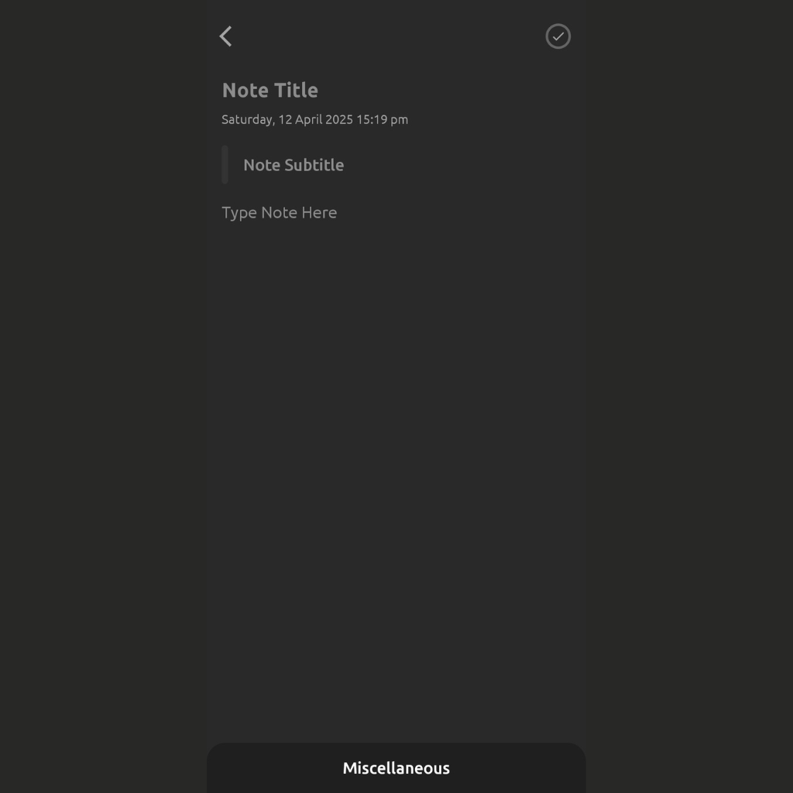

# Android Notes App 📒

An Android Notes application built using **Java**, **Room Database**, and **Android Studio**. This app allows users to create, edit, and delete notes. It also supports adding **images** and **URL links** to notes.

---

## ✨ Features

- 📝 Create, edit, and delete notes
- 🖼️ Add images from gallery or camera
- 🔗 Add clickable URLs in notes
- 🔍 Search notes
- 🗃️ Room Database integration for local storage
- 💡 Clean and user-friendly interface

---

## 🛠️ Tech Stack

- **Language**: Java
- **IDE**: Android Studio
- **Database**: Room (SQLite wrapper)
- **Architecture**: MVVM (Model-View-ViewModel)
- **UI**: XML Layouts

---

## 📱 Screenshots

*(Add screenshots here — you can upload them to your repo and then use the relative path like ``)*
```markdown


